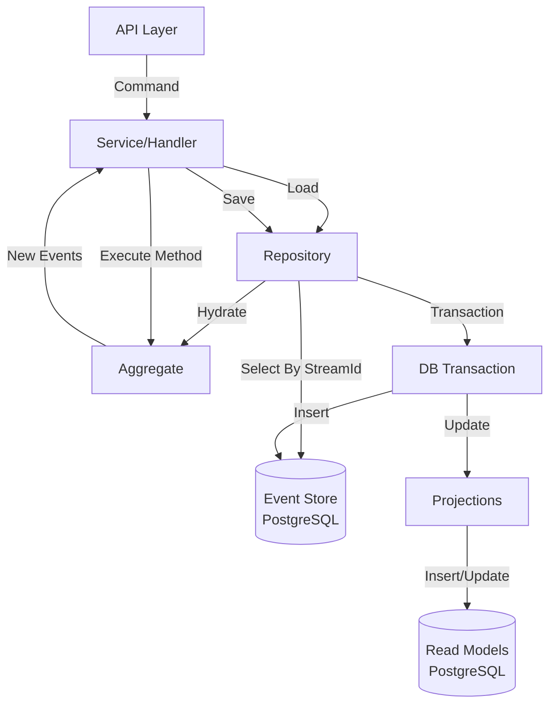

# Event Sourcing Architecture with Postgres

This document outlines an Event Sourcing architecture using PostgreSQL as both the Event Store and the Read Model store.

## 1. High-Level Overview



## 2. Database Schema

### 2.1 Event Store Table (`events`)
This is the single source of truth.

```sql
CREATE TABLE events (
  id BIGSERIAL PRIMARY KEY,
  stream_id UUID NOT NULL,          -- The Aggregate ID
  version INT NOT NULL,             -- Sequential version for the stream (1, 2, 3...)
  type VARCHAR(100) NOT NULL,       -- Event Name (e.g., 'ReservationCreated')
  data JSONB NOT NULL,              -- The Event Payload
  metadata JSONB,                   -- Audit info, correlation IDs, etc.
  occurred_at TIMESTAMPTZ DEFAULT NOW(),
  
  -- Optimistic Locking: (stream_id, version) must be unique
  CONSTRAINT events_stream_version_unique UNIQUE (stream_id, version)
);

-- Index for fast loading of streams
CREATE INDEX idx_events_stream_id ON events(stream_id);
```

### 2.2 Read Models (Example: `reservations`)
Optimized for querying. Driven by Projections.

```sql
CREATE TABLE reservations (
  id UUID PRIMARY KEY,
  guest_name TEXT NOT NULL,
  status TEXT NOT NULL,
  check_in_date DATE,
  updated_at TIMESTAMPTZ
);
```

## 3. Code Components

### 3.1 Event Definitions (`shared-schema`)
Define your events using Zod for runtime validation and static typing.

```typescript
// packages/shared-schema/src/domain/reservation/events/index.ts
import { z } from 'zod';

export const ReservationCreatedEventSchema = z.object({
  type: z.literal('ReservationCreated'),
  data: z.object({
    reservationId: z.string().uuid(),
    guestId: z.string().uuid(),
    startDate: z.string().datetime()
  })
});

export const ReservationCancelledEventSchema = z.object({
  type: z.literal('ReservationCancelled'),
  data: z.object({
    reason: z.string()
  })
});

export const ReservationEventSchema = z.discriminatedUnion('type', [
  ReservationCreatedEventSchema,
  ReservationCancelledEventSchema
]);

export type ReservationEvent = z.infer<typeof ReservationEventSchema>;
```

### 3.2 Aggregate
Pure domain logic. Reconstructs state from events.

```typescript
export class ReservationAggregate {
  id: string;
  status: 'PENDING' | 'CONFIRMED' | 'CANCELLED' = 'PENDING';
  version: number = 0;

  constructor(id: string) {
    this.id = id;
  }

  // Rehydrate state from history
  loadFromHistory(events: ReservationEvent[]) {
    for (const event of events) {
      this.apply(event);
      this.version++;
    }
  }

  // State mutation
  private apply(event: ReservationEvent) {
    switch(event.type) {
      case 'ReservationCreated':
        this.status = 'CONFIRMED';
        break;
      case 'ReservationCancelled':
        this.status = 'CANCELLED';
        break;
    }
  }

  // Business Logic -> New Event
  cancel(reason: string): ReservationEvent {
    if (this.status === 'CANCELLED') throw new Error('Already cancelled');
    
    return {
      type: 'ReservationCancelled',
      data: { reason }
    };
  }
}
```

### 3.3 Repository (Postgres Integration)
Handles loading and saving.

```typescript
import { Pool } from 'pg'; // or any query builder like Kysely

class ReservationRepository {
  constructor(private db: Pool) {}
  
  async load(id: string): Promise<ReservationAggregate> {
    const res = await this.db.query(
      `SELECT type, data FROM events WHERE stream_id = $1 ORDER BY version ASC`,
      [id]
    );
    
    const aggregate = new ReservationAggregate(id);
    const events = res.rows.map(row => ReservationEventSchema.parse({
      type: row.type,
      data: row.data
    }));
    
    aggregate.loadFromHistory(events);
    return aggregate;
  }

  async save(aggregate: ReservationAggregate, newEvents: ReservationEvent[]) {
    // Start Transaction
    const client = await this.db.connect();
    try {
      await client.query('BEGIN');
      
      let nextVersion = aggregate.version + 1;
      
      for (const event of newEvents) {
        // 1. Insert Event
        await client.query(
          `INSERT INTO events (stream_id, version, type, data) VALUES ($1, $2, $3, $4)`,
          [aggregate.id, nextVersion, event.type, event.data]
        );
        
        // 2. Run Projections (Synchronous / Strict Consistency)
        await applyProjection(client, aggregate.id, event);
        
        nextVersion++;
      }
      
      await client.query('COMMIT');
    } catch (e) {
      await client.query('ROLLBACK');
      throw e;
    } finally {
      client.release();
    }
  }
}
```

### 3.4 Projections
Translates events into Read Models.

```typescript
async function applyProjection(client: any, aggregateId: string, event: ReservationEvent) {
  if (event.type === 'ReservationCreated') {
    await client.query(
      `INSERT INTO reservations (id, status) VALUES ($1, 'CONFIRMED')`,
      [aggregateId]
    );
  }
  if (event.type === 'ReservationCancelled') {
    await client.query(
      `UPDATE reservations SET status = 'CANCELLED' WHERE id = $1`,
      [aggregateId]
    );
  }
}
```

## 4. Best Practices Checklist
- [ ] **Optimistic Concurrency**: Always use the `version` column constraint to prevent race conditions during writes.
- [ ] **Validation**: Use Zod to ensure events in the DB match your code's expectations.
- [ ] **Consistency**: Start with synchronous projections (in the same transaction) for simplicity. Move to async (using Postgres LISTEN/NOTIFY or queue) only if performance requires it.
- [ ] **Immutability**: Never update or delete existing rows in the `events` table (except for rare GDPR purges).
