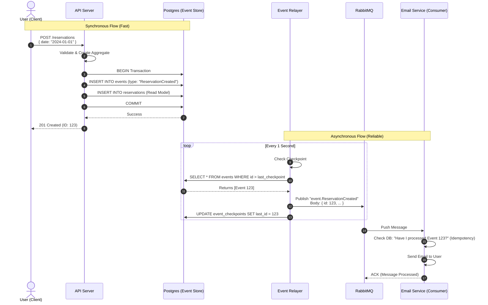

# Request Lifecycle Example: Create Reservation

This document illustrates the full lifecycle of a "Create Reservation" request, demonstrating the **Transactional Outbox** pattern with the **Event Relayer**.

## Flow Diagram

## Step-by-Step Breakdown

### 1. The Request (Synchronous)

**Goal**: Save the data safely and respond to the user quickly.

* **Action**: User sends a `POST` request to your API.
* **What happens**:
  * **Validation**: API validates the inputs.
  * **Domain Logic**: `ReservationAggregate` is instantiated and `create(...)` is called.
  * **Atomic Write**: The API opens a transaction and performs two inserts:
        1. `INSERT INTO events`: The immutable fact that the reservation happened.
        2. `INSERT INTO reservations`: The projection for efficient querying by your frontend.
  * **Commit**: The transaction is committed. If this fails, everything fails (safe).
* **Result**: The API returns `201 Created` to the user immediately. The user sees "Success".

### 2. The Relay (Asynchronous Background)

**Goal**: Reliably transport the event to external systems without slowing down the user.

* **Action**: The **Event Relayer** (a separate background process) wakes up.
* **What happens**:
  * **Poll**: It queries Postgres: "Give me any events that happened since I last checked."
  * **Fetch**: Postgres returns the new `ReservationCreated` event (ID 123).
  * **Publish**: The Relayer pushes the event payload to **RabbitMQ** (Exchange: `domain_events`, Routing Key: `event.ReservationCreated`).
  * **Checkpoint**: Once RabbitMQ confirms receipt (ACK), the Relayer updates its `event_checkpoints` table in Postgres (`last_processed_id = 123`).

### 3. The Consumption (External Service)

**Goal**: Perform side effects (emails, analytics, 3rd party sync) safely.

* **Action**: The **Email Notification Service** receives the message.
* **What happens**:
  * **Idempotency Check**: The service checks its own local database: *"Did I already process Event ID 123?"*
  * **Process**:
    * If **No**: It sends the email and saves `123` to its `processed_events` table.
    * If **Yes**: It skips processing (prevents duplicate emails in case of retries).
  * **Ack**: The service tells RabbitMQ "Done".
