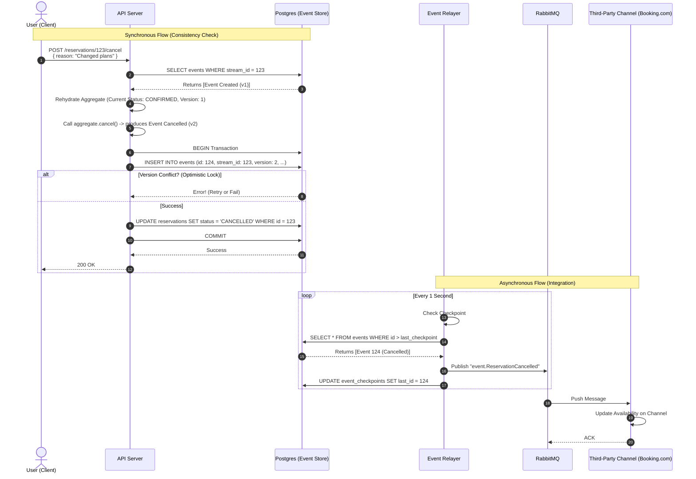

# Request Lifecycle Example: Update Reservation (Cancel)

This document illustrates the full lifecycle of an **Update** request (specifically canceling a reservation). The key difference from creation is the **Load-Modify-Save** cycle using Optimistic Concurrency Control.

## Flow Diagram

## Step-by-Step Breakdown

### 1. The Request (Synchronous)

**Goal**: Ensure we are modifying the *latest* state of the reservation.

* **Action**: User sends a request to Cancel Reservation `123`.
* **What happens**:
  * **Load**: Repository fetches *all* past events for Stream ID `123`.
  * **Rehydrate**: `ReservationAggregate` is rebuilt from scratch (Status becomes `CONFIRMED`, `version` becomes `1`).
  * **Domain Logic**: `aggregate.cancel("reason")` is called.
    * *Check*: Is it already cancelled? (No).
    * *Result*: Generates a new `ReservationCancelled` event.
  * **Optimistic Save**: The API attempts to save the new event with `version = 2`.
    * **SQL Constraint**: `UNIQUE(stream_id, version)` ensures that if someone else modified it to v2 just now, this transaction fails.
  * **Projections**: Update the `reservations` read model table to `CANCELLED`.
  * **Commit**: The transaction is committed.

### 2. The Relay (Asynchronous Background)

**Goal**: Propagate the change.

* **Action**: The **Event Relayer** wakes up.
* **What happens**:
  * It sees the new Event #124 (`ReservationCancelled`).
  * It publishes it to RabbitMQ.
  * It updates the checkpoint.

### 3. The Consumption (External Service)

**Goal**: Sync external systems (e.g., reopen the calendar slot).

* **Action**: The **Channel Manager Integration** receives the message.
* **What happens**:
  * It sees "Reservation 123 is CANCELLED".
  * It calls the Booking.com API to make that room available again.
  * It ACKs the message.
